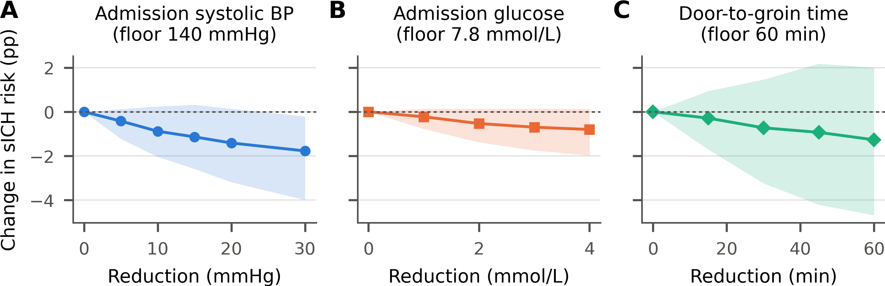
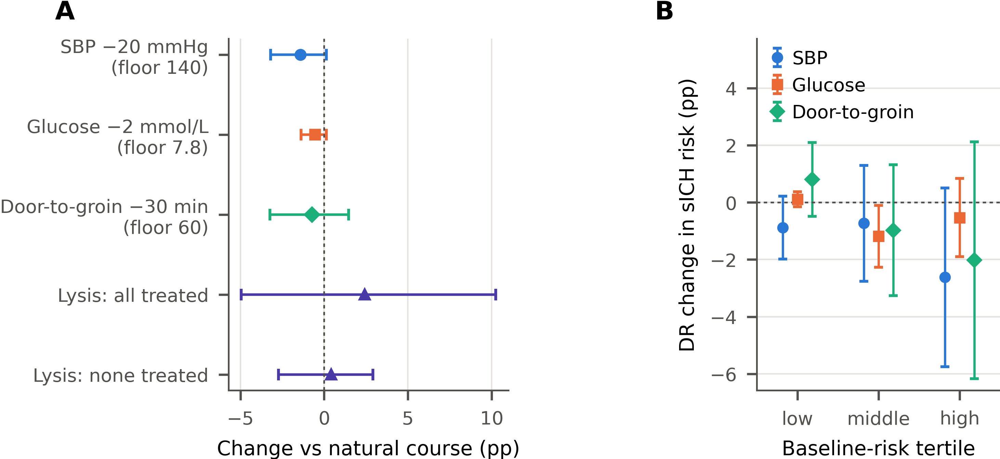

# Counterfactual effects of modifiable peri-procedural factors on sICH after thrombectomy

Causal counterfactual analysis of **symptomatic intracranial haemorrhage (sICH)** after endovascular
thrombectomy (EVT): *what would the sICH risk have been if a modifiable factor had been managed
differently?*

Prediction models say **who** is at risk, and counterfactual *explanations* (e.g. DiCE) say what would
change a **model's output**. Neither says what would happen to **patients** if a factor were changed.
This repository estimates causal counterfactual risks under **modified treatment policies (MTPs)** —
for example, *"lower admission systolic blood pressure by 20 mmHg, but not below 140 mmHg"* — with a
cross-fitted **doubly robust** estimator and **bootstrap** inference.

> **Data are not included.** The cohort contains patient-level clinical data and is not public.
> Place the dataset as `dataset.xlsx` in the repository root to reproduce the analysis.

## Results

Cohort: 469 EVT patients, 65 sICH (13.9%). Risk differences are in **percentage points (pp)** versus
the natural course. **Bootstrap 95% CIs** (200 resamples of the whole cross-fitted procedure) are the
primary inference; influence-function (IF) CIs are shown for comparison only (they under-cover, see
simulation below).

| Exposure | Policy | Risk: policy vs natural | Change (pp) | Bootstrap 95% CI | IF 95% CI |
|---|---|---|---|---|---|
| Admission systolic BP | −20 mmHg, not below 140 | 12.4% vs 13.9% | **−1.41** | −3.19 to +0.14 | −2.72 to −0.10 |
| Admission glucose | −2 mmol/L, not below 7.8 | 13.4% vs 14.0% | **−0.53** | −1.38 to +0.14 | −1.13 to +0.07 |
| Door-to-groin time | −30 min, not below 60 | 13.1% vs 13.9% | **−0.73** | −3.24 to +1.46 | −2.39 to +0.94 |
| Bridging thrombolysis | all treated | 16.3% vs 13.9% | **+2.42** | −4.95 to +10.24 | −3.41 to +8.26 |
| Bridging thrombolysis | none treated | 14.3% vs 13.9% | **+0.43** | −2.72 to +2.90 | −1.74 to +2.59 |
| Bridging thrombolysis | treated vs untreated | 16.3% vs 14.3% | **+1.99** | −6.94 to +11.45 | −5.48 to +9.47 |

### Counterfactual dose–response



*Change in sICH risk as each policy lowers the exposure by a larger step without crossing the floor.
Bands: bootstrap 95% CIs.*

| Exposure | Policy | Change (pp) | Bootstrap 95% CI | Excludes 0 | Patients shifted | ESS |
|---|---|---|---|---|---|---|
| Admission systolic BP | −5 mmHg (floor 140) | −0.42 | −1.22 to +0.12 | no | 43% | 459 |
| Admission systolic BP | −10 mmHg (floor 140) | −0.88 | −2.04 to +0.24 | no | 43% | 443 |
| Admission systolic BP | −15 mmHg (floor 140) | −1.14 | −2.59 to +0.31 | no | 43% | 416 |
| Admission systolic BP | −20 mmHg (floor 140) | −1.41 | −3.19 to +0.14 | no | 43% | 399 |
| Admission systolic BP | −30 mmHg (floor 140) | −1.77 | −3.99 to −0.21 | yes | 43% | 369 |
| Admission glucose | −1 mmol/L (floor 7.8) | −0.23 | −0.78 to +0.14 | no | 28% | 432 |
| Admission glucose | −2 mmol/L (floor 7.8) | −0.53 | −1.38 to +0.14 | no | 28% | 423 |
| Admission glucose | −3 mmol/L (floor 7.8) | −0.70 | −1.75 to +0.15 | no | 28% | 415 |
| Admission glucose | −4 mmol/L (floor 7.8) | −0.80 | −1.98 to +0.14 | no | 28% | 408 |
| Door-to-groin time | −15 min (floor 60) | −0.29 | −1.71 to +0.94 | no | 94% | 418 |
| Door-to-groin time | −30 min (floor 60) | −0.73 | −3.24 to +1.46 | no | 94% | 325 |
| Door-to-groin time | −45 min (floor 60) | −0.93 | −4.20 to +2.18 | no | 94% | 236 |
| Door-to-groin time | −60 min (floor 60) | −1.27 | −4.68 to +2.00 | no | 94% | 177 |

Lowering admission systolic BP gives a graded reduction in sICH risk; the bootstrap interval excludes
zero only at the largest step (30 mmHg). Influence-function intervals would have declared the 10, 15 and
20 mmHg steps significant as well. Glucose, door-to-groin time and bridging thrombolysis show no
detectable effect.

### Policy contrasts and effects by baseline risk



*(A) Primary policies with bootstrap 95% CIs. (B) Doubly robust effects within tertiles of baseline
predicted risk (IF-based 95% CIs, descriptive).* For systolic BP the change was −0.89 pp in the
lowest and −2.62 pp in the highest risk tertile.

### Structural support from causal discovery

Share of the 10 training folds in which the exposure was a possible ancestor of / adjacent to sICH in
the learned graph (PC + GES under temporal-tier constraints):

| Exposure | Ancestor of sICH | Adjacent to sICH |
|---|---|---|
| Admission systolic BP | 90% | 20% |
| Admission glucose | 100% | 0% |
| Door-to-groin time | 0% | 0% |
| Bridging thrombolysis | 100% | 0% |

### Ablations (primary step; IF-based intervals)

| Exposure | Configuration | Change (pp) | IF 95% CI |
|---|---|---|---|
| Admission systolic BP | PRIMARY: DR, tier-based set, flexible, ratio truncated | −1.41 | −2.72 to −0.10 |
| Admission systolic BP | − outcome model (IPW only) | −1.45 | −2.95 to +0.05 |
| Admission systolic BP | − density ratio (g-computation only) | −0.70 | −0.82 to −0.59 |
| Admission systolic BP | linear instead of flexible nuisances | −0.88 | −3.23 to +1.46 |
| Admission systolic BP | graph-based adjustment set | −1.48 | −2.76 to −0.19 |
| Admission systolic BP | minimal clinical adjustment set | −1.09 | −2.49 to +0.32 |
| Admission systolic BP | no ratio truncation | −1.32 | −2.68 to +0.04 |
| Admission glucose | PRIMARY: DR, tier-based set, flexible, ratio truncated | −0.53 | −1.13 to +0.07 |
| Admission glucose | − outcome model (IPW only) | −0.50 | −1.19 to +0.19 |
| Admission glucose | − density ratio (g-computation only) | −0.26 | −0.32 to −0.20 |
| Admission glucose | linear instead of flexible nuisances | −0.13 | −0.79 to +0.54 |
| Admission glucose | graph-based adjustment set | −0.50 | −1.10 to +0.11 |
| Admission glucose | minimal clinical adjustment set | −0.80 | −1.55 to −0.04 |
| Admission glucose | no ratio truncation | −0.54 | −1.14 to +0.06 |
| Door-to-groin time | PRIMARY: DR, tier-based set, flexible, ratio truncated | −0.73 | −2.39 to +0.94 |
| Door-to-groin time | − outcome model (IPW only) | −0.78 | −2.72 to +1.17 |
| Door-to-groin time | − density ratio (g-computation only) | −0.44 | −0.50 to −0.38 |
| Door-to-groin time | linear instead of flexible nuisances | −1.43 | −3.93 to +1.07 |
| Door-to-groin time | graph-based adjustment set | −1.01 | −2.74 to +0.71 |
| Door-to-groin time | minimal clinical adjustment set | −0.83 | −2.87 to +1.21 |
| Door-to-groin time | no ratio truncation | −0.77 | −2.44 to +0.90 |
| Door-to-groin time | + mediators adjusted (INAPPROPRIATE, negative control) | −0.76 | −2.37 to +0.85 |
| Bridging thrombolysis | PRIMARY: AIPW, flexible (treated vs untreated) | +1.99 | −5.48 to +9.47 |
| Bridging thrombolysis | linear instead of flexible nuisances | +8.65 | −13.35 to +30.64 |

### Simulation check of the estimator

Known-truth simulation (n = 470, 50 replicates, policy "−20 above a floor of 140"):

| Outcome model | Truth (pp) | Density ratio | DR bias (pp) | SD (pp) | IF CI coverage |
|---|---|---|---|---|---|
| linear | −4.27 | truncated 0.99, raw ratio (used) | −0.224 | 1.34 | 0.82 |
| linear | −4.27 | truncated 0.99, normalised ratio | −0.315 | 1.38 | 0.84 |
| linear | −4.27 | untruncated, normalised ratio | −0.340 | 1.40 | 0.84 |
| non-linear | −5.67 | truncated 0.99, raw ratio (used) | +0.073 | 1.56 | 0.80 |
| non-linear | −5.67 | truncated 0.99, normalised ratio | −0.039 | 1.61 | 0.76 |
| non-linear | −5.67 | untruncated, normalised ratio | −0.070 | 1.65 | 0.76 |

The doubly robust point estimate is close to unbiased and beats g-computation when the outcome model is
non-linear (g-computation bias +0.41 pp), but **influence-function intervals cover the truth in only
76–84% of replicates** at this sample size. This is why conclusions rest on bootstrap intervals. The
bootstrap itself was not validated by simulation (too costly).

## Method

For an exposure *A*, floor *c* and step δ, the policy is

    d(a) = max(a − δ, c)  if a > c,   otherwise a

and the estimand is the counterfactual risk ψ(δ) = E[Y^d(A)] and its difference from the natural
course, θ(δ) = ψ(δ) − E[Y]. The one-step doubly robust estimator uses the efficient influence function

    φ = r(A,W) · (Y − m(A,W)) + m(d(A),W),        θ̂ = mean(φ − Y)

- *m*: outcome regression; *r*: density ratio between the shifted and observed exposure distribution,
  learned by **classification** (observed vs shifted exposures stacked), truncated at the 99th percentile.
- Nuisances: average of l2-logistic regression and random forest, **cross-fitted** on 5 folds; two
  repeats combined by the median-of-splits rule.
- **Adjustment sets**: variables in the same or an earlier temporal tier (baseline → onset → admission
  → procedure), minus graph descendants and known mediators (e.g. thrombolysis for BP and glucose,
  post-puncture procedural variables for door-to-groin time).
- Bridging thrombolysis: AIPW for "everyone treated" and "no one treated".
- **Inference**: nonparametric bootstrap of the entire procedure; resampled copies of a patient stay in
  one fold (`StratifiedGroupKFold`) to avoid leakage.
- Ablations: IPW only, g-computation only, linear nuisances, graph-based / minimal adjustment sets, no
  ratio truncation, and a mediator-adjusted negative control.

## Changes relative to the original analysis code

| | Original | This repository |
|---|---|---|
| Tier of reperfusion grade (`TICI_ordinal`) | missing from `TIER_MAP`, defaulted to *admission* (forced e.g. eTICI → passes) | **fixed**: procedure tier |
| Counterfactuals | DiCE explanations of a prediction model (non-causal) | **causal** MTP counterfactuals, doubly robust |
| Scope | conformal prediction, multitask learning, integer score, passes dose–response | removed (covered elsewhere); passes are not a well-defined intervention here |

## Repository layout

| File | Purpose |
|---|---|
| `sich_counterfactual.py` | **main analysis**: discovery, MTPs, AIPW, bootstrap, ablations |
| `make_figures.py` | print-size figures (12.4 cm) from the outputs |
| `test_mtp_simulation.py` | known-truth simulation of the estimator (linear scenario) |
| `simulation_variants.py` | simulation comparing density-ratio variants (both scenarios) |
| `simulation_results.csv` | simulation results reported above |
| `sich_pipeline.py`, `sich_multitask_causal.py`, `sich_prediction_v2.py`, `sich_novel_analyses.py`, `sich_learning_curve.py` | data loading, preprocessing and causal discovery helpers (tier fix applied) |
| `outputs_counterfactual/` | aggregated results (CSV/JSON); patient-level outputs are excluded |
| `figures/` | result figures |

## Reproduce

```bash
pip install -r requirements.txt
# put the dataset at ./dataset.xlsx
SICH_DATA=dataset.xlsx python sich_counterfactual.py      # ~45 min on 8 cores (200 bootstrap resamples)
python make_figures.py outputs_counterfactual figures
# quick smoke test: SICH_QUICK=1 SICH_BOOT=30 python sich_counterfactual.py
```

## Limitations

Single cohort of 469 patients (65 events), no external validation. Causal conclusions assume no
unmeasured confounding given the adjustment sets; E-values are modest (≈1.2–1.6). The policies shift
measured admission values and do not correspond to a specific treatment protocol; admission BP is
distinct from the post-reperfusion BP targets tested in randomised trials. Within-stratum intervals
are influence-function based and likely too narrow.

## Second cohort: END after minor stroke

The same estimators applied to early neurological deterioration in 932 patients with minor ischaemic
stroke are in [`minor_stroke_END/`](minor_stroke_END/README.md).
