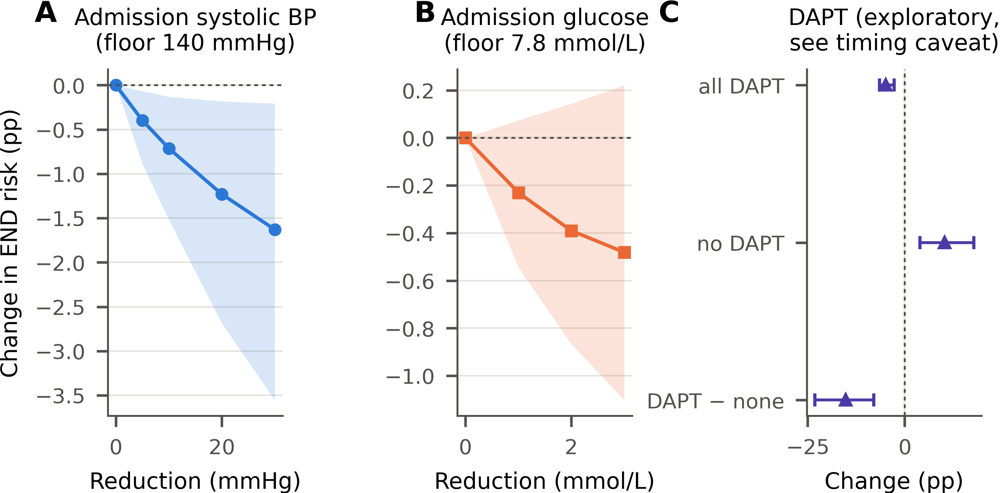
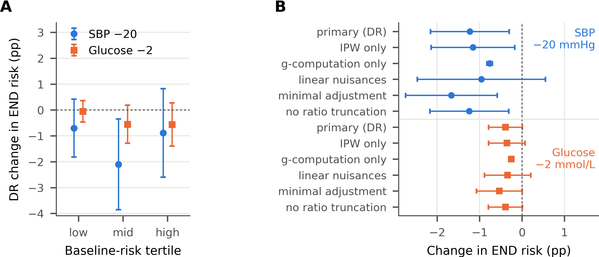

# Counterfactual effects on early neurological deterioration (END) after minor stroke

Causal counterfactual analysis of **early neurological deterioration (END)** in patients with minor
ischaemic stroke: *what would the END risk have been if admission blood pressure, glucose or dual
antiplatelet therapy had been managed differently?*

The analysis re-uses the estimators in [`../sich_counterfactual.py`](../sich_counterfactual.py):
modified treatment policies (MTPs) with a cross-fitted **doubly robust** one-step estimator, a
classification-based density ratio, AIPW for binary treatments, and a nonparametric **bootstrap**
of the whole procedure (200 resamples).

> **Data are not included.** The cohort contains patient-level clinical data and is not public.
> Place the dataset as `data_minor_stroke.xlsx` in this folder (or set `MINOR_DATA`) to reproduce.

## Cohort and design

* 932 patients with minor ischaemic stroke (NIHSS ≤ 5, items 1a–1c = 0), admitted within 24 h of last
  known normal; 119 candidate variables.
* Outcome: END = NIHSS increase ≥ 2 points within 72 h of admission. **123 / 932 (13.2%)**.
  Haemorrhagic transformation was not analysed (7 events).
* Exposures
  * admission systolic BP: MTP "lower by δ, not below 140 mmHg" (δ = 5, 10, 20, 30)
  * admission glucose: MTP "lower by δ, not below 7.8 mmol/L" (δ = 1, 2, 3)
  * dual antiplatelet therapy (DAPT): static policies "everyone" vs "no one" (AIPW)
* Adjustment: all baseline and admission variables (temporal tiers: baseline → admission →
  in-hospital treatment → outcome); never in-hospital treatments or anything recorded after END.
* Nuisances: average of L2-logistic regression and random forest (300 trees, min leaf 10),
  5-fold stratified cross-fitting × 2 repeats, median aggregation; density ratio truncated at the
  99th percentile; propensities bounded to [0.02, 0.98].

## Results

Risk differences are in **percentage points (pp)** versus the natural course (13.2%).
**Bootstrap 95% CIs** are the primary inference; influence-function (IF) CIs are shown for comparison.

| Exposure | Policy | Risk: policy vs natural | Change (pp) | Bootstrap 95% CI | IF 95% CI |
|---|---|---|---|---|---|
| Admission systolic BP | −20 mmHg, not below 140 | 12.0% vs 13.2% | **−1.23** | −2.69 to −0.18 | −2.16 to −0.30 |
| Admission glucose | −2 mmol/L, not below 7.8 | 12.8% vs 13.2% | **−0.39** | −0.87 to +0.14 | −0.79 to +0.01 |
| DAPT\* | everyone on DAPT | 8.3% vs 13.2% | −4.89 | −6.45 to −2.69 | −6.62 to −3.16 |
| DAPT\* | no one on DAPT | 23.5% vs 13.2% | +10.29 | +3.92 to +17.81 | +5.24 to +15.33 |
| DAPT\* | DAPT vs no DAPT | 8.3% vs 23.5% | −15.18 | −23.16 to −7.99 | −21.47 to −8.88 |

\* Exploratory, not causal — see the timing caveat below.



*(A, B) Change in END risk as each policy lowers the exposure by a larger step without crossing the
floor; bands are bootstrap 95% CIs. (C) DAPT for everyone, for no one, and their difference.*

### Dose–response

| Exposure | Policy | Change (pp) | Bootstrap 95% CI | Excludes 0 | Patients shifted | ESS | E-value |
|---|---|---|---|---|---|---|---|
| Admission systolic BP | −5 mmHg | −0.40 | −0.89 to −0.07 | yes | 56% | 915 | 1.21 |
| Admission systolic BP | −10 mmHg | −0.71 | −1.52 to −0.13 | yes | 56% | 884 | 1.30 |
| Admission systolic BP | −20 mmHg | −1.23 | −2.69 to −0.18 | yes | 56% | 792 | 1.44 |
| Admission systolic BP | −30 mmHg | −1.63 | −3.55 to −0.21 | yes | 56% | 706 | 1.54 |
| Admission glucose | −1 mmol/L | −0.23 | −0.54 to +0.07 | no | 32% | 922 | 1.15 |
| Admission glucose | −2 mmol/L | −0.39 | −0.87 to +0.14 | no | 32% | 906 | 1.21 |
| Admission glucose | −3 mmol/L | −0.48 | −1.10 to +0.22 | no | 32% | 887 | 1.24 |

Lowering admission systolic BP gives a graded reduction in END risk, and every bootstrap interval
excludes zero. Glucose shows no detectable effect. Effective sample sizes (ESS) stay high, so
positivity is not a concern for the MTPs.

### Baseline-risk strata and ablations



*(A) Doubly robust change in END risk within tertiles of baseline predicted risk. (B) One component
removed at a time at the primary steps. IF-based 95% CIs.*

| Exposure | Configuration | Change (pp) | IF 95% CI |
|---|---|---|---|
| Admission systolic BP | PRIMARY: DR, tier-based set, flexible, ratio truncated | −1.23 | −2.16 to −0.30 |
| Admission systolic BP | − outcome model (IPW only) | −1.16 | −2.14 to −0.17 |
| Admission systolic BP | − density ratio (g-computation only) | −0.76 | −0.83 to −0.70 |
| Admission systolic BP | linear instead of flexible nuisances | −0.96 | −2.47 to +0.55 |
| Admission systolic BP | minimal clinical adjustment set | −1.66 | −2.74 to −0.59 |
| Admission systolic BP | no ratio truncation | −1.24 | −2.17 to −0.31 |
| Admission glucose | PRIMARY: DR, tier-based set, flexible, ratio truncated | −0.39 | −0.79 to +0.01 |
| Admission glucose | − outcome model (IPW only) | −0.36 | −0.79 to +0.07 |
| Admission glucose | − density ratio (g-computation only) | −0.25 | −0.29 to −0.22 |
| Admission glucose | linear instead of flexible nuisances | −0.34 | −0.89 to +0.21 |
| Admission glucose | minimal clinical adjustment set | −0.54 | −1.07 to +0.00 |
| Admission glucose | no ratio truncation | −0.39 | −0.79 to +0.01 |
| DAPT | crude (unadjusted) difference | −13.79 | — |
| DAPT | PRIMARY: AIPW, tier-based set, flexible | −15.18 | −21.47 to −8.88 |
| DAPT | linear instead of flexible nuisances | −13.79 | −30.23 to +2.64 |
| DAPT | minimal clinical adjustment set | −15.68 | −21.23 to −10.13 |
| DAPT | restricted to DAPT or SAPT patients | −14.66 | −21.37 to −7.96 |

## DAPT timing caveat

Treatment start times were not recorded. Among patients with END, the share on DAPT rises from 19%
when END appeared earliest to 59% when it appeared latest, so patients who deteriorated early had
little time to receive DAPT before END (or received it afterwards). The adjusted DAPT estimate barely
differs from the crude one and far exceeds trial effects on recurrence; it mixes reverse causation
and must not be read as causal. Cardioembolic patients (TOAST 2) never received DAPT, which also
violates positivity.

## Reproduce

```bash
pip install -r ../requirements.txt
python minor_stroke_counterfactual.py                 # ~20 min on 8 cores; SICH_QUICK=1 SICH_BOOT=30 for a smoke test
python minor_figures.py outputs_minor figures
```

| File | Content |
|---|---|
| `minor_stroke_counterfactual.py` | data loading, temporal tiers, MTPs, AIPW for DAPT, ablations, strata |
| `minor_figures.py` | Figures 1–2 (12.4 cm wide, print-ready) |
| `outputs_minor/` | aggregate results only (no patient-level rows) |
| `figures/` | PNG (600 dpi) and PDF figures |
