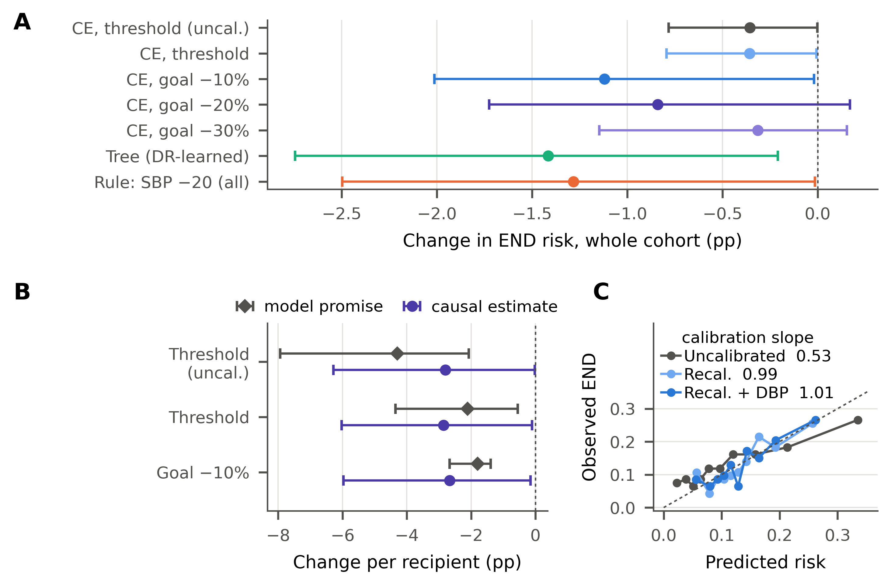
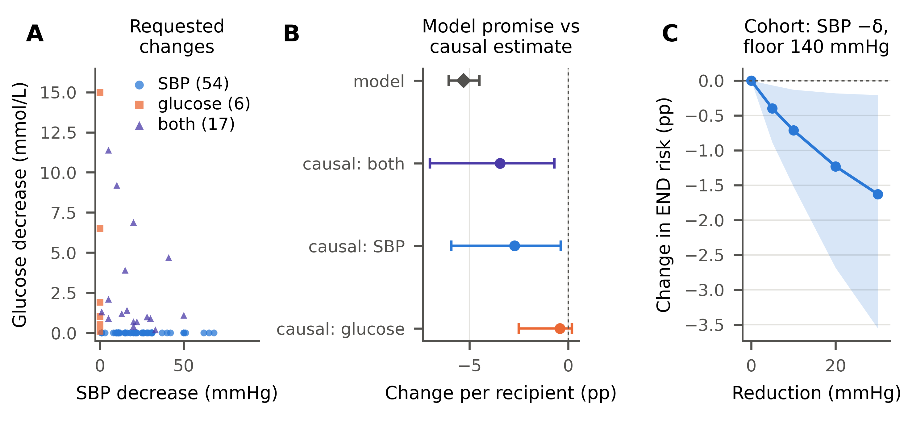

# Counterfactual explanations and causal effects for early neurological deterioration (END) after minor stroke

Two analyses of **early neurological deterioration (END)** in patients with minor ischaemic stroke:

* **Machine-learning counterfactual explanations with a causal check** ([`minor_ce_v5.py`](minor_ce_v5.py),
  main; [`minor_ce.py`](minor_ce.py), first version): what would a risk model need to see changed in
  admission blood pressure or glucose, and would that change actually lower END risk?
* **Causal counterfactual policies** ([`minor_stroke_counterfactual.py`](minor_stroke_counterfactual.py)):
  what would END risk have been if admission blood pressure, glucose or dual antiplatelet therapy had been
  managed differently?

Both re-use the estimators in [`../sich_counterfactual.py`](../sich_counterfactual.py): modified treatment
policies (MTPs) with a cross-fitted **doubly robust** one-step estimator, a classification-based density
ratio, AIPW for binary treatments, and a nonparametric **bootstrap** (200 resamples).

> **Data are not included.** The cohort contains patient-level clinical data and is not public.
> Place the dataset as `data_minor_stroke.xlsx` in this folder (or set `MINOR_DATA`) to reproduce.

## Cohort and design

* 932 patients with minor ischaemic stroke (NIHSS ≤ 5, items 1a–1c = 0), admitted within 24 h of last
  known normal; 119 candidate variables.
* Outcome: END = NIHSS increase ≥ 2 points within 72 h of admission. **123 / 932 (13.2%)**.
  Haemorrhagic transformation was not analysed (7 events).
* Exposures
  * admission systolic BP: MTP "lower by δ, not below 140 mmHg" (δ = 5, 10, 20, 30)
  * admission glucose: MTP "lower by δ, not below 7.8 mmol/L" (δ = 1, 2, 3)
  * dual antiplatelet therapy (DAPT): static policies "everyone" vs "no one" (AIPW)
* Adjustment: all baseline and admission variables (temporal tiers: baseline → admission →
  in-hospital treatment → outcome); never in-hospital treatments or anything recorded after END.
* Nuisances: average of L2-logistic regression and random forest (300 trees, min leaf 10),
  5-fold stratified cross-fitting × 2 repeats, median aggregation; density ratio truncated at the
  99th percentile; propensities bounded to [0.02, 0.98].

## Main result: goal-based interventional counterfactual explanations (`minor_ce_v5.py`)

Threshold explanations (smallest change that pushes a flagged patient just below a risk threshold) reached
only ~12% of patients. Version 5 keeps the causal machinery and changes the **objective** of the
explanation:

1. **Risk model.** XGBoost on 94 baseline and admission variables, monotone in admission systolic BP (SBP)
   and glucose, Platt-recalibrated on inner out-of-fold predictions (AUC 0.64, calibration slope
   1.01; uncalibrated XGBoost: AUC 0.64, slope 0.53).
2. **Interventional explanations** (Karimi et al. 2021). Lowering SBP or glucose is an intervention in a
   structural causal model: diastolic BP, the only input downstream of the actionable factors, follows an
   additive-noise equation DBP = β·SBP + h(baseline) + u (β = 0.37, R² = 0.43), so
   DBP′ = DBP + β(SBP′ − SBP). Values are only lowered, never below 140 mmHg / 7.8 mmol/L.
3. **Objectives.** *Threshold*: flagged patients (risk ≥ Youden threshold) get the smallest change that
   brings risk below the threshold. *Goal −ρ*: **every** patient with room above a floor gets the smallest
   change that lowers predicted risk by at least ρ (10/20/30%, pre-specified).
4. **Causal evaluation.** Every policy (models, thresholds, explanations, tree) is learned inside training
   folds of 5-fold cross-fitting (median of 10 splits) and applied to held-out patients; its effect is
   estimated with the doubly robust MTP estimator; CIs from 200 bootstrap resamples that repeat the whole
   procedure (nested bootstrap).

| Policy | Patients changed | Cohort change, pp (95% CI) | Per recipient, pp (95% CI) | Model promise, pp |
|---|---|---|---|---|
| CE, threshold (uncalibrated model) | 118 (13%) | −0.36 (−0.78 to −0.001) | −2.8 (−6.3 to −0.02) | −4.3 |
| CE, threshold | 116 (12%) | −0.36 (−0.79 to −0.01) | −2.9 (−6.0 to −0.1) | −2.1 |
| **CE, goal −10%** | 391 (42%) | −1.12 (−2.01 to −0.02) | −2.7 (−6.0 to −0.1) | −1.8 |
| CE, goal −20% | 180 (19%) | −0.84 (−1.73 to +0.17) | −4.3 (−12.0 to +5.4) | −3.3 |
| CE, goal −30% | 58 (6%) | −0.31 (−1.15 to +0.15) | −5.0 (−16.7 to +14.0) | −4.9 |
| Policy tree (DR-learned) | 470 (50%) | −1.41 (−2.74 to −0.21) | −2.8 (−5.1 to −0.5) | — |
| Rule: SBP −20, floor 140 | 524 (56%) | −1.28 (−2.50 to −0.01) | −2.3 (−4.4 to −0.03) | — |

Natural-course END risk 13.2%. Explanations from the recalibrated model are causally faithful (promise
consistent with the causal estimate). Re-targeting them to a 10% relative risk reduction extends
recommendations from 12% to 42% of patients and lowers cohort END risk by
1.12 pp, about four fifths of the policy tree; the gain over threshold explanations
(0.76 pp, 95% CI −0.16 to 1.45) does not exclude zero. Stricter targets are feasible for
fewer patients and are imprecise.



*(A) Causal change in END risk for the whole cohort under each policy. (B) Risk reduction per recipient
promised by the model versus the doubly robust causal estimate. (C) Calibration by decile.
Nested-bootstrap 95% CIs.*

## Earlier version: threshold explanations held fixed (`minor_ce.py`)

Machine-learning counterfactual explanations say what a risk model would need to see changed; they do not
say whether that change would lower the patient's real risk. [`minor_ce.py`](minor_ce.py) checks this:

1. **Risk model.** LightGBM (reference: L2-logistic regression) on 93 baseline and admission variables
   (no in-hospital treatment, nothing after END; diastolic BP left out because it moves with systolic BP),
   5-fold CV repeated twice. High-risk threshold = Youden's index on out-of-fold predictions.
2. **Counterfactual explanations** (Wachter et al. 2017) for every out-of-fold high-risk patient: the
   smallest MAD-weighted L1 decrease of admission systolic BP (not below 140 mmHg) and glucose (not below
   7.8 mmol/L) that brings the model's risk below the threshold, all other variables fixed. The action
   space is 2-D, so the optimum is found exactly by exhaustive search (1 mmHg × 0.1 mmol/L grid).
3. **Causal check.** The explanations define a patient-specific policy (flagged patients get their
   explanation values, everyone else keeps the observed values). Its effect on END risk is estimated with
   the cross-fitted doubly robust MTP estimator (2-D exposure) and 200 bootstrap resamples (explanations
   held fixed), and compared with the reduction the model promises.

| Step | Result |
|---|---|
| Risk model | LightGBM AUC 0.64, AUPRC 0.22, Brier 0.112, calibration slope 0.61 (logistic AUC 0.58) |
| High-risk patients (threshold 0.156) | 229 (54 with END) |
| Explanation found | 77 / 229 (34%); 44 already at or below both floors, 108 with no permitted change that works |
| Changes asked for | 71 lower SBP (median 20 mmHg, IQR 11–30), 23 lower glucose (median 1.2 mmol/L), 17 both |
| Model's predicted risk, recipients | 20.0% → 14.7%: **promised −5.3 pp per recipient** |

| Policy | Patients changed | Cohort change (pp) | Bootstrap 95% CI | Per recipient (pp) |
|---|---|---|---|---|
| Explanations: both factors | 77 (8.3%) | −0.28 | −0.58 to −0.06 | **−3.4** (−7.0 to −0.7) |
| Explanations: SBP part only | 71 (7.6%) | −0.22 | −0.49 to −0.03 | −2.7 |
| Explanations: glucose part only | 23 (2.5%) | −0.03 | −0.21 to +0.02 | −0.4 |

The causal estimate confirms a reduction, driven by the blood-pressure part, but its point estimate is
about two-thirds of what the model promises (the interval still includes the promise); the glucose part
has little causal support. Patient-level model and causal changes correlate only moderately (r = 0.38).
Effective sample size 927 of 932, so positivity is not a concern.



*(A) Decreases asked for by the explanations. (B) Risk reduction per recipient promised by the model
versus the doubly robust causal estimate. (C) Whole-cohort policy "SBP −δ, not below 140 mmHg".
Bootstrap 95% CIs.*

## Whole-cohort policies and DAPT (causal analysis)

Risk differences are in **percentage points (pp)** versus the natural course (13.2%).
**Bootstrap 95% CIs** are the primary inference; influence-function (IF) CIs are shown for comparison.

| Exposure | Policy | Risk: policy vs natural | Change (pp) | Bootstrap 95% CI | IF 95% CI |
|---|---|---|---|---|---|
| Admission systolic BP | −20 mmHg, not below 140 | 12.0% vs 13.2% | **−1.23** | −2.69 to −0.18 | −2.16 to −0.30 |
| Admission glucose | −2 mmol/L, not below 7.8 | 12.8% vs 13.2% | **−0.39** | −0.87 to +0.14 | −0.79 to +0.01 |
| DAPT\* | everyone on DAPT | 8.3% vs 13.2% | −4.89 | −6.45 to −2.69 | −6.62 to −3.16 |
| DAPT\* | no one on DAPT | 23.5% vs 13.2% | +10.29 | +3.92 to +17.81 | +5.24 to +15.33 |
| DAPT\* | DAPT vs no DAPT | 8.3% vs 23.5% | −15.18 | −23.16 to −7.99 | −21.47 to −8.88 |

\* Exploratory, not causal — see the timing caveat below.


*(A, B) Change in END risk as each policy lowers the exposure by a larger step without crossing the
floor; bands are bootstrap 95% CIs. (C) DAPT for everyone, for no one, and their difference.*

### Dose–response

| Exposure | Policy | Change (pp) | Bootstrap 95% CI | Excludes 0 | Patients shifted | ESS | E-value |
|---|---|---|---|---|---|---|---|
| Admission systolic BP | −5 mmHg | −0.40 | −0.89 to −0.07 | yes | 56% | 915 | 1.21 |
| Admission systolic BP | −10 mmHg | −0.71 | −1.52 to −0.13 | yes | 56% | 884 | 1.30 |
| Admission systolic BP | −20 mmHg | −1.23 | −2.69 to −0.18 | yes | 56% | 792 | 1.44 |
| Admission systolic BP | −30 mmHg | −1.63 | −3.55 to −0.21 | yes | 56% | 706 | 1.54 |
| Admission glucose | −1 mmol/L | −0.23 | −0.54 to +0.07 | no | 32% | 922 | 1.15 |
| Admission glucose | −2 mmol/L | −0.39 | −0.87 to +0.14 | no | 32% | 906 | 1.21 |
| Admission glucose | −3 mmol/L | −0.48 | −1.10 to +0.22 | no | 32% | 887 | 1.24 |

Lowering admission systolic BP gives a graded reduction in END risk, and every bootstrap interval
excludes zero. Glucose shows no detectable effect. Effective sample sizes (ESS) stay high, so
positivity is not a concern for the MTPs.

### Baseline-risk strata and ablations


*(A) Doubly robust change in END risk within tertiles of baseline predicted risk. (B) One component
removed at a time at the primary steps. IF-based 95% CIs.*

| Exposure | Configuration | Change (pp) | IF 95% CI |
|---|---|---|---|
| Admission systolic BP | PRIMARY: DR, tier-based set, flexible, ratio truncated | −1.23 | −2.16 to −0.30 |
| Admission systolic BP | − outcome model (IPW only) | −1.16 | −2.14 to −0.17 |
| Admission systolic BP | − density ratio (g-computation only) | −0.76 | −0.83 to −0.70 |
| Admission systolic BP | linear instead of flexible nuisances | −0.96 | −2.47 to +0.55 |
| Admission systolic BP | minimal clinical adjustment set | −1.66 | −2.74 to −0.59 |
| Admission systolic BP | no ratio truncation | −1.24 | −2.17 to −0.31 |
| Admission glucose | PRIMARY: DR, tier-based set, flexible, ratio truncated | −0.39 | −0.79 to +0.01 |
| Admission glucose | − outcome model (IPW only) | −0.36 | −0.79 to +0.07 |
| Admission glucose | − density ratio (g-computation only) | −0.25 | −0.29 to −0.22 |
| Admission glucose | linear instead of flexible nuisances | −0.34 | −0.89 to +0.21 |
| Admission glucose | minimal clinical adjustment set | −0.54 | −1.07 to +0.00 |
| Admission glucose | no ratio truncation | −0.39 | −0.79 to +0.01 |
| DAPT | crude (unadjusted) difference | −13.79 | — |
| DAPT | PRIMARY: AIPW, tier-based set, flexible | −15.18 | −21.47 to −8.88 |
| DAPT | linear instead of flexible nuisances | −13.79 | −30.23 to +2.64 |
| DAPT | minimal clinical adjustment set | −15.68 | −21.23 to −10.13 |
| DAPT | restricted to DAPT or SAPT patients | −14.66 | −21.37 to −7.96 |

## DAPT timing caveat

Treatment start times were not recorded. Among patients with END, the share on DAPT rises from 19%
when END appeared earliest to 59% when it appeared latest, so patients who deteriorated early had
little time to receive DAPT before END (or received it afterwards). The adjusted DAPT estimate barely
differs from the crude one and far exceeds trial effects on recurrence; it mixes reverse causation
and must not be read as causal. Cardioembolic patients (TOAST 2) never received DAPT, which also
violates positivity.

## Reproduce

```bash
pip install -r ../requirements.txt
python minor_stroke_counterfactual.py                 # ~20 min on 8 cores; SICH_QUICK=1 SICH_BOOT=30 for a smoke test
python minor_figures.py outputs_minor figures
python minor_ce.py                                    # first version, ~7 min on 8 cores
SICH_REPEATS=10 python -c "import minor_ce_v5; minor_ce_v5.main()"   # main analysis, ~26 min on 8 cores
python ce_v5_figures.py                               # Figure_ce_v5
python ce_figures.py outputs_ce outputs_minor figures # panel A needs the local, patient-level ce_individual.csv
```

| File | Content |
|---|---|
| `minor_stroke_counterfactual.py` | data loading, temporal tiers, MTPs, AIPW for DAPT, ablations, strata |
| `minor_figures.py` | Figures 1–2 (12.4 cm wide, print-ready) |
| `minor_ce_v5.py` | main analysis: recalibrated XGBoost, interventional explanations (threshold and goal objectives), policy tree, nested bootstrap |
| `ce_v5_figures.py` | Figure_ce_v5 |
| `outputs_ce_v5/` | aggregate results of the main analysis (policies, model performance, calibration deciles, tree leaves) |
| `minor_ce.py` | first version (explanations held fixed in the bootstrap); also provides shared helpers for `minor_ce_v5.py` |
| `ce_figures.py` | counterfactual-explanation figure |
| `outputs_ce/` | aggregate results only (`ce_individual.csv` is patient-level and git-ignored) |
| `outputs_minor/` | aggregate results only (no patient-level rows) |
| `figures/` | PNG (600 dpi) and PDF figures |
